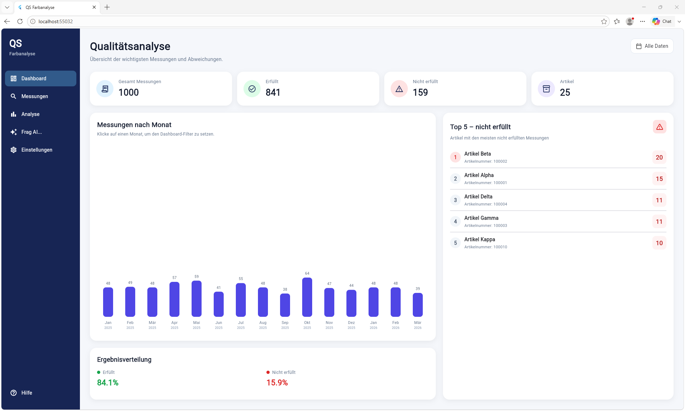
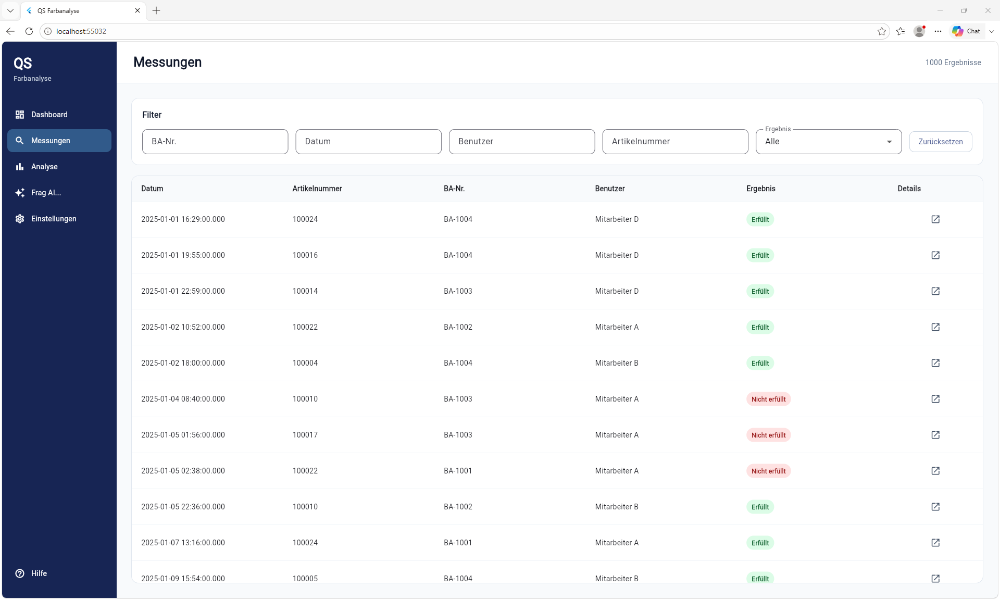
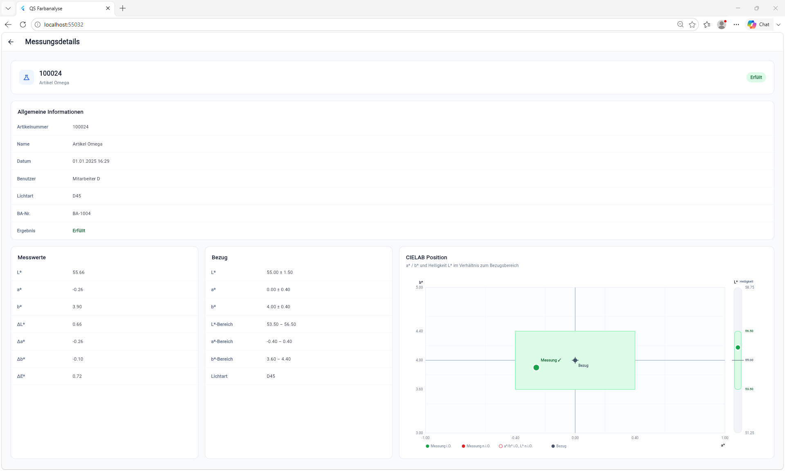
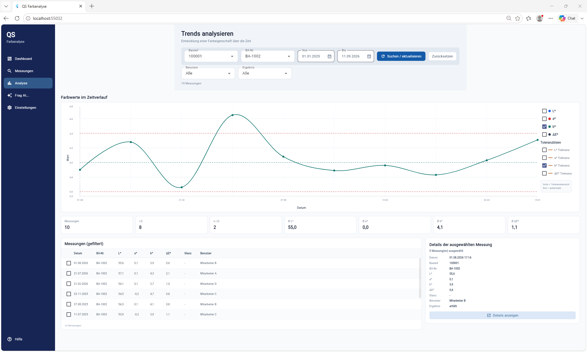
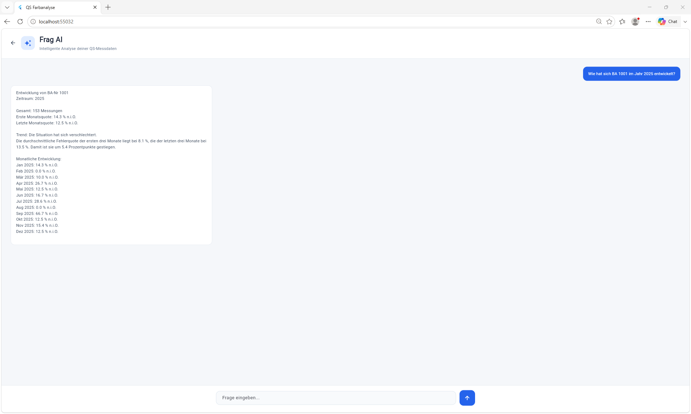

# QS App — Flutter Prototype

A Flutter-based Quality Management application prototype for color measurement data visualization, filtering, analysis and natural-language interaction.

## Overview

The **QS App** was developed from a real-world Quality Management use case with the goal of making color measurement data easier to explore, visualize and analyze.

The project started as a Flutter prototype using fictional measurement data and evolved into a functional application covering measurement management, CIELAB analysis, tolerance evaluation, production batch comparison and a local natural-language analysis interface.

This repository represents the **completed prototype and public portfolio version** of the project.

The prototype later served as the foundation for an internal implementation connected to a real industrial measurement-data source. Company-specific integration, infrastructure and production data are intentionally not included in this public repository.

---

## Domain Terminology

The application uses several terms commonly found in German manufacturing and Quality Management environments:

| Term | Meaning | Description |
|------|---------|-------------|
| **QS** | *Qualitätssicherung* | German term for Quality Assurance (QA). The application name **QS App** reflects its original industrial context. |
| **BA / BA-Nr.** | *Betriebsauftrag* (Production Order) | Identifies a specific production order or batch. Measurements belonging to the same BA can be grouped and analyzed together. |
| **i.O.** | *in Ordnung* | Measurement is within the defined tolerances. Equivalent to **OK**. |
| **n.i.O.** | *nicht in Ordnung* | Measurement is outside one or more defined tolerances. Equivalent to **NOK (Not OK)**. |
| **Artikelnummer** | Article Number | Identifies the manufactured part or product. Multiple production orders (BAs) can belong to the same article. |
| **Messung** | Measurement | A recorded color measurement for a manufactured part. |
| **Bezug / Standard** | Reference / Standard | The reference color values against which a measurement is evaluated. |

---

## Application Preview

### Dashboard

Overview of measurement activity, quality results, monthly development and articles with the highest number of non-conforming measurements.



### Measurement Data

Searchable and filterable overview of individual color measurements.



### Measurement Details

Detailed inspection of an individual measurement, including CIELAB values, deviations, reference values and tolerance information.



### Analysis

Time-based analysis of measurement characteristics with production-order filtering and tolerance visualization.



### Frag AI

Natural-language interface for querying and analyzing the fictional measurement dataset.



---

## Main Features

### Dashboard

- Overview of measurement activity
- Measurement result statistics
- i.O. / n.i.O. distribution
- Production batch statistics
- Article-based measurement information
- Quick overview of relevant Quality Management indicators

### Measurements

- Measurement data overview
- Search and filtering
- Filtering by:
  - BA-Nr.
  - Article number
  - User
  - Date
  - Measurement result
- Detailed measurement views
- Reference and tolerance information

### Color Measurement Analysis

The application works with CIELAB-based color measurement information, including:

- L*
- a*
- b*
- ΔL*
- Δa*
- Δb*
- ΔE*

The analysis interface provides:

- Graph-based measurement visualization
- Measurement development over time
- Tolerance visualization for L*, a* and b*
- Comparison between different BA-Nr.
- Detection and visualization of deviations
- Time-based analysis of measurement results

### Frag AI

The application includes a local natural-language analysis interface called **Frag AI**.

Users can ask questions about the measurement dataset in natural language.

Example questions:

> "Wie viele Messungen haben wir insgesamt?"

> "Welche Artikel haben die meisten Abweichungen?"

> "Wie hat sich BA 1001 im Jahr 2025 entwickelt?"

> "Vergleiche BA 1001 und BA 1002."

> "Wie entwickelt sich ΔE* über die Zeit?"

The prototype uses a **local deterministic analysis engine** rather than an external AI or cloud service.

The engine interprets questions, identifies relevant entities and filters, performs calculations against the measurement dataset and generates structured responses.

It can identify information such as:

- BA-Nr.
- Article numbers
- Measurement dimensions
- Years and time periods
- Measurement status
- Tolerance deviations
- Comparisons between production batches
- Development and trends over time

The prototype architecture also allows the analysis layer to be extended in the future with an LLM while keeping measurement calculations and validation deterministic.

---

## Technology Stack

- **Flutter**
- **Dart**
- **fl_chart**
- **CSV**
- **Material Design**
- **Git**
- **GitHub**

---

## Data

The public prototype uses a completely **fictional measurement dataset** created for development and demonstration purposes.

The dataset contains **1,000 measurements** covering the period from January 2025 to September 2026.

It includes fictional:

- Measurement values
- Article numbers
- BA numbers
- Users
- Reference values
- Measurement results
- Tolerances

**No confidential company data or real production measurement data is included in this repository.**

---

## Application Architecture

The prototype follows a modular Flutter structure:

```text
Fictional Measurement Data
          │
          ▼
     Data / Models
          │
          ▼
      Flutter App
          │
          ├── Dashboard
          │
          ├── Messungen
          │      │
          │      └── Messungsdetails
          │
          ├── Analyse
          │
          └── Frag AI
                 │
                 ▼
        Local Analysis Engine
```

The separation between measurement data, application views and analysis logic made it possible to develop and validate the application independently from the final industrial data source.

---

## Project Structure

```text
lib/
├── main.dart
├── models/
├── pages/
│   ├── dashboard_page.dart
│   ├── analyse_page.dart
│   ├── frag_ai_page.dart
│   ├── messungen_page.dart
│   └── messungsdetails_page.dart
├── services/
│   └── ai_analyzer.dart
└── widgets/
    └── sidebar.dart

assets/
└── fictional measurement data
```

The exact structure may evolve as the project is refactored, but the application is organized around separate UI, data and analysis responsibilities.

---

## Development Process

The application was developed incrementally from an initial Flutter experiment into a functional Quality Management analysis prototype.

Development included:

- Defining the application requirements from a real QS use case
- Designing the measurement data model
- Building the Flutter application structure
- Creating reusable UI components
- Implementing filtering and navigation
- Developing measurement detail views
- Visualizing CIELAB measurement data
- Implementing tolerance and deviation logic
- Developing production batch comparisons
- Implementing time-based analysis
- Building the Frag AI natural-language interface
- Testing against the complete fictional dataset
- Preparing the architecture for migration to a real data source

Git and GitHub were used for version control and to document the development history of the project.

---

## Key Technical Challenges

The project involved solving several practical development problems rather than only building the user interface.

### Measurement Data Modeling

Color measurement data contains measured values, reference values, deviations, tolerances and production-related identifiers.

The application required a structured model capable of supporting both individual measurement inspection and aggregate analysis.

### Dynamic Filtering

Measurements can be filtered and analyzed across several dimensions, including BA number, article, date, user and result.

The filtering logic had to remain consistent between measurement views and analytical functions.

### Tolerance Evaluation

CIELAB deviations need to be evaluated against their corresponding tolerance limits.

The prototype implements tolerance-based analysis and visualizes whether measurements remain within the expected range.

### Production Batch Comparison

Measurements belonging to different BA numbers can be grouped and compared, making it possible to analyze differences between production batches of the same or different articles.

### Time-Based Analysis

Measurement results can be ordered and analyzed chronologically to identify changes and trends over time.

### Natural-Language Analysis

Frag AI required converting natural-language questions into deterministic analysis operations.

The engine identifies the requested subject, filters the appropriate measurements and calculates the result locally without sending measurement data to an external AI service.

### Preparing for a Real Data Source

The prototype was intentionally structured so that the fictional data source could later be replaced without rebuilding the entire application.

This became important when the project progressed beyond the prototype stage.

---

## From Prototype to Real-World Integration

After the prototype demonstrated that the application concept was viable, development progressed toward an internal implementation using a **real industrial measurement-data source**.

This transition required work beyond the scope of the original prototype, including:

- Mapping the prototype data model to real measurement structures
- Replacing fictional data with a real data source
- Implementing database connectivity
- Validating calculations against real measurement data
- Adapting tolerance handling to real measurement specifications
- Testing the application with real production-scale datasets
- Troubleshooting data-access and integration issues
- Improving application reliability for internal use

The public repository remains intentionally focused on the prototype.

**Company-specific database connectivity, infrastructure details, database structures and real production data are not included.**

---

## AI-Assisted Development

AI tools were used as part of the development workflow for:

- Code generation assistance
- Debugging
- Troubleshooting
- Exploring implementation approaches
- Reviewing implementation ideas
- Refactoring and improving code

The project required defining the application requirements, designing the data and application structure, integrating generated solutions, debugging technical issues, testing functionality and validating the resulting behavior.

AI was used as a **development tool**, while implementation decisions and functional validation remained part of the development process.

---

## Prototype Milestones

- [x] Initial Flutter project
- [x] Fictional measurement dataset
- [x] Measurement data model
- [x] Dashboard
- [x] Measurement overview
- [x] Measurement detail view
- [x] Search and filtering
- [x] CIELAB visualization
- [x] Tolerance analysis
- [x] Measurement trend analysis
- [x] BA-Nr. comparison
- [x] Time-based analysis
- [x] Frag AI interface
- [x] Local natural-language analysis engine
- [x] Functional prototype validation
- [x] Prototype used as foundation for real-data integration

---

## Prototype Status

**Status: Completed Functional Prototype / Portfolio Version**

This repository represents the completed public prototype stage of the QS App.

It demonstrates the application concept, user interface, data model, measurement analysis, tolerance evaluation, production batch comparison and local natural-language analysis using fictional data.

Development subsequently progressed into an internal version connected to a real industrial measurement-data source.

The internal implementation is not published in this repository because it contains company-specific integration and infrastructure.

---

## What This Project Demonstrates

This project demonstrates practical experience with:

- Flutter and Dart application development
- Structured data modeling
- Data filtering and transformation
- Data visualization
- Quality measurement analysis
- CIELAB color data
- Tolerance-based evaluation
- Time-series analysis
- Production batch comparison
- Natural-language query processing
- Debugging and troubleshooting
- Git and GitHub
- Iterative application development
- Transitioning a prototype toward a real-world data integration

---

## Author

**Francisco de Castro Rodrigues**

Application concept, requirements, Flutter/Dart development, implementation, integration, testing, debugging and project development.

---

## Disclaimer

This repository is a **portfolio and demonstration project**.

All measurement data included in the public version is fictional.

No confidential company information, credentials, internal infrastructure details or real production measurement data are included.